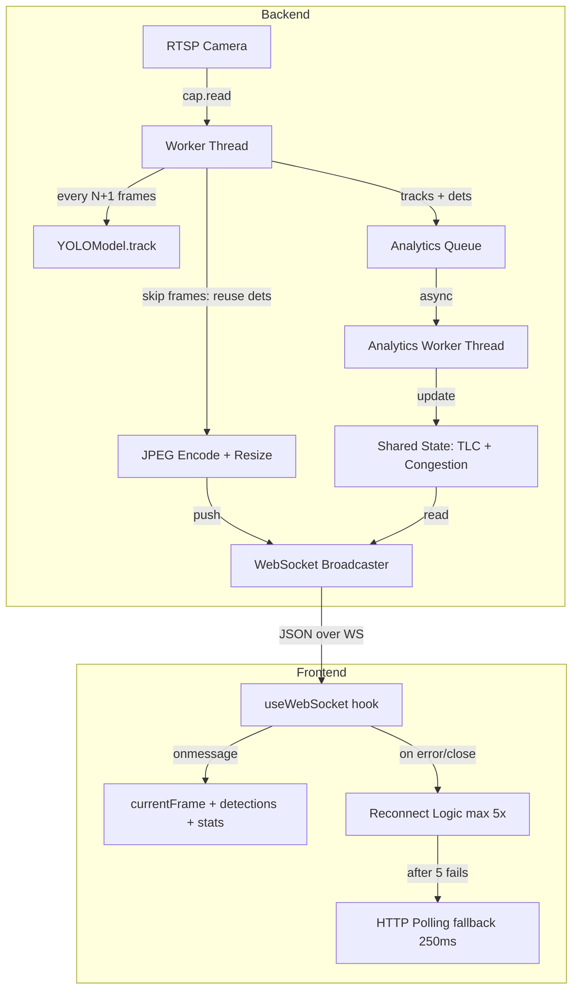

# Design Document: RTSP FPS Optimization

## Overview

Hệ thống hiện tại bị giới hạn FPS hiển thị do kiến trúc HTTP polling (tối đa 4 FPS), YOLO inference đồng bộ chặn pipeline, và JPEG quality cao làm tăng kích thước payload. Thiết kế này thay thế polling bằng WebSocket, tách analytics ra thread riêng, thêm skip-frame inference, và cho phép cấu hình linh hoạt để đạt FPS hiển thị cao hơn.

Mục tiêu: từ ~4 FPS hiển thị lên 15–25 FPS tùy phần cứng.

## Architecture



## Components and Interfaces

### Backend

**1. WebSocket endpoint** (`backend/app/api/ws_routes.py`)
- Route: `GET /ws/stream` (WebSocket upgrade)
- Quản lý danh sách active connections bằng `ConnectionManager`
- Broadcast payload tới tất cả clients khi có frame mới
- Tách biệt hoàn toàn với HTTP polling endpoint (vẫn giữ `/stream/frame`)

```python
class ConnectionManager:
    def __init__(self): self.active: list[WebSocket] = []
    async def connect(self, ws: WebSocket): ...
    def disconnect(self, ws: WebSocket): ...
    async def broadcast(self, data: str): ...
```

**2. StreamService thay đổi** (`backend/app/services/stream_service.py`)

Thêm các thuộc tính mới:
```python
self.jpeg_quality: int = settings.STREAM_JPEG_QUALITY   # default 75
self.max_width: int = settings.STREAM_MAX_WIDTH          # default 0
self.skip_frames: int = settings.INFERENCE_SKIP_FRAMES   # default 0
self._skip_counter: int = 0
self._last_raw_dets: list = []                           # reuse khi skip
self._analytics_queue: queue.Queue = queue.Queue(maxsize=10)
self._analytics_thread: threading.Thread | None = None
# Metrics
self.fps_capture: float = 0.0
self.fps_inference: float = 0.0
self.fps_sent: float = 0.0
self.avg_inference_ms: float = 0.0
self._infer_times: deque = deque(maxlen=10)
```

Worker loop thay đổi:
```
1. cap.read() → frame
2. flush RTSP buffer (grab N lần)
3. resize nếu max_width > 0
4. if skip_counter % (skip_frames+1) == 0: chạy YOLO → lưu _last_raw_dets
   else: dùng _last_raw_dets
5. encode JPEG với jpeg_quality
6. push payload vào ws_broadcaster (async-safe)
7. push (tracks, dets) vào analytics_queue (non-blocking, drop nếu đầy)
```

**3. Analytics Worker** (tách từ `_worker`)
- Thread riêng đọc từ `_analytics_queue`
- Xử lý: ROI counting, VehicleCounter, CongestionMonitor, TrafficLight logic, BehaviorExtractor
- Cập nhật `self._stats` (thread-safe với lock)
- Không ảnh hưởng đến FPS gửi frame

**4. Settings mới** (`backend/app/core/config.py`)
```python
STREAM_JPEG_QUALITY: int = 75
STREAM_MAX_WIDTH: int = 0
INFERENCE_SKIP_FRAMES: int = 0
YOLO_IMGSZ: int = 640
RTSP_FLUSH_FRAMES: int = 2
```

**5. SettingsUpdate model mở rộng** (`backend/app/models/detection_model.py`)
```python
class SettingsUpdate(BaseModel):
    # ... existing fields ...
    jpeg_quality: Optional[int] = Field(None, ge=30, le=95)
    max_width: Optional[int] = Field(None, ge=0, le=1920)
    skip_frames: Optional[int] = Field(None, ge=0, le=10)
```

**6. VehicleStats mở rộng**
```python
class VehicleStats(BaseModel):
    # ... existing fields ...
    fps_capture: float = 0.0
    fps_inference: float = 0.0
    fps_sent: float = 0.0
    avg_inference_ms: float = 0.0
```

### Frontend

**1. useWebSocket hook** (`frontend/src/hooks/useWebSocket.ts`)
```typescript
interface UseWebSocketOptions {
  url: string;
  onMessage: (data: FramePayload) => void;
  maxRetries?: number;      // default 5
  retryDelay?: number;      // default 2000ms
}

function useWebSocket(options: UseWebSocketOptions): {
  connected: boolean;
  usingFallback: boolean;
  disconnect: () => void;
}
```

Reconnect logic:
- Khi `onclose` hoặc `onerror`: tăng `retryCount`
- Nếu `retryCount < maxRetries`: `setTimeout(connect, retryDelay)`
- Nếu `retryCount >= maxRetries`: set `usingFallback = true` → trigger HTTP polling

**2. useDetection thay đổi** (`frontend/src/hooks/useDetection.ts`)
- Thay `setInterval(250ms)` bằng `useWebSocket`
- Giữ nguyên HTTP polling fallback khi `usingFallback = true`
- Expose `wsConnected` và `usingFallback` state

**3. api.ts thêm WebSocket URL helper**
```typescript
export function getWebSocketUrl(path: string): string {
  const proto = window.location.protocol === 'https:' ? 'wss:' : 'ws:';
  const host = import.meta.env.VITE_WS_HOST || window.location.host;
  return `${proto}//${host}${path}`;
}
```

## Data Models

### WebSocket Message Format
```json
{
  "frame": "<base64 JPEG string>",
  "detections": [
    { "bbox": {"x1":0,"y1":0,"x2":100,"y2":100}, "class_name": "car", "confidence": 0.92, "track_id": 1 }
  ],
  "stats": {
    "fps": 18.5,
    "fps_capture": 25.0,
    "fps_inference": 8.3,
    "fps_sent": 18.5,
    "avg_inference_ms": 120.4,
    "total": 42,
    ...
  }
}
```

### Settings GET Response (mở rộng)
```json
{
  "conf_threshold": 0.35,
  "line_position": 0.55,
  "max_fps": 30,
  "jpeg_quality": 75,
  "max_width": 0,
  "skip_frames": 0,
  "tracker_type": "bytetrack",
  "counting_mode": "all",
  "congestion_threshold": 10,
  "congestion_duration": 5.0
}
```

## Correctness Properties

*A property là đặc tính hoặc hành vi phải đúng với mọi đầu vào hợp lệ của hệ thống — về cơ bản là phát biểu hình thức về những gì hệ thống phải làm. Properties là cầu nối giữa đặc tả dạng văn bản và đảm bảo tính đúng đắn có thể kiểm chứng tự động.*

---

Property 1: WebSocket payload luôn có đủ trường
*For any* message nhận được từ WebSocket `/ws/stream`, message phải parse được thành JSON và chứa đủ ba trường `frame` (string), `detections` (array), `stats` (object).
**Validates: Requirements 1.2, 1.5**

---

Property 2: Frame resize không vượt max_width
*For any* frame có chiều rộng W và cấu hình `max_width` M > 0, frame sau khi encode phải có chiều rộng <= M. Khi M = 0, chiều rộng frame không thay đổi.
**Validates: Requirements 2.3, 2.4**

---

Property 3: Skip frame reuse detections
*For any* chuỗi N+1 frame liên tiếp với `skip_frames = N`, frame thứ 2 đến N+1 phải có detections giống hệt frame thứ 1 (frame inference). Tổng số frame gửi đi phải bằng tổng số frame đọc được.
**Validates: Requirements 3.2, 3.3, 3.4**

---

Property 4: FPS sent phản ánh số frame gửi
*For any* khoảng thời gian T giây, `fps_sent` phải xấp xỉ bằng số frame gửi đi trong T giây chia cho T (sai số <= 10%).
**Validates: Requirements 3.5, 8.1**

---

Property 5: YOLO_IMGSZ validation
*For any* giá trị `YOLO_IMGSZ` không thuộc tập {320, 416, 480, 640}, hệ thống phải sử dụng giá trị mặc định 640 thay vì giá trị đó.
**Validates: Requirements 4.3, 4.4**

---

Property 6: Settings update áp dụng ngay
*For any* giá trị `jpeg_quality` hợp lệ được PATCH qua API, frame tiếp theo được encode phải dùng đúng giá trị quality đó (kiểm tra qua kích thước file JPEG tương đối).
**Validates: Requirements 5.2**

---

Property 7: Analytics queue không block frame gửi
*For any* trạng thái analytics queue (kể cả đầy), thời gian từ khi đọc frame đến khi push vào WebSocket broadcaster phải không bị block bởi analytics. Khi queue đầy, item mới phải bị drop (không block).
**Validates: Requirements 7.2, 7.4**

---

Property 8: WebSocket reconnect retry limit
*For any* chuỗi lỗi WebSocket liên tiếp, frontend phải thử reconnect tối đa 5 lần với delay >= 2000ms giữa các lần. Sau 5 lần thất bại, phải chuyển sang HTTP polling fallback.
**Validates: Requirements 9.3, 10.2**

---

Property 9: avg_inference_ms là sliding window 10 frame
*For any* chuỗi inference times [t1, t2, ..., tN] với N >= 10, `avg_inference_ms` phải bằng trung bình của 10 giá trị gần nhất (sai số <= 1ms).
**Validates: Requirements 8.4**

## Error Handling

- **WebSocket client disconnect**: `ConnectionManager.disconnect()` xóa khỏi danh sách, không ảnh hưởng các client khác.
- **Analytics queue đầy**: `queue.put_nowait()` với `except queue.Full: pass` — drop frame cũ, không block worker.
- **YOLO inference lỗi**: Giữ nguyên `_last_raw_dets`, ghi log warning, tiếp tục gửi frame.
- **Resize lỗi**: Bỏ qua resize, gửi frame gốc, ghi log debug.
- **WebSocket broadcast lỗi**: Xóa connection lỗi khỏi danh sách, tiếp tục broadcast cho các client còn lại.

## Testing Strategy

### Unit Tests
- Test `ConnectionManager`: connect, disconnect, broadcast tới nhiều clients.
- Test skip frame logic: đếm số lần YOLO được gọi với skip_frames = N.
- Test resize logic: frame rộng hơn max_width phải được resize đúng.
- Test YOLO_IMGSZ validation: giá trị invalid phải fallback về 640.
- Test analytics queue drop: khi queue đầy, `put_nowait` không raise exception.

### Property-Based Tests
Sử dụng **pytest + hypothesis** (Python) và **vitest** (TypeScript).

Mỗi property test chạy tối thiểu 100 iterations.

- **Property 1**: Generate random frame data, kiểm tra WebSocket message schema.
- **Property 2**: Generate random frame sizes và max_width values, kiểm tra output width.
- **Property 3**: Generate random skip_frames values và frame sequences, kiểm tra reuse behavior.
- **Property 5**: Generate random imgsz values, kiểm tra validation logic.
- **Property 8**: Simulate WebSocket failures, kiểm tra retry count và fallback trigger.
- **Property 9**: Generate random inference time sequences, kiểm tra sliding window average.

Tag format: `# Feature: rtsp-fps-optimization, Property N: <property_text>`
